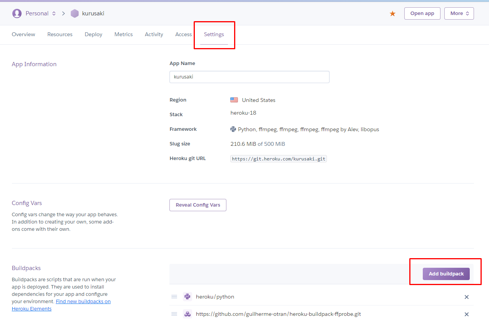

# This repository's purpose is just an EXAMPLE code for streaming audio in discord from heroku. 
#### Please feel free to create pull requests or issue posts on this repository.
#### For command help menu, mention the bot and type help or enter `s.help`
### You will require build packs in Heroku for your bot to be able to play audio on discord. 
#### You will only need the ffmpeg buildpack [`jonathanong-ffmpeg`](https://github.com/jonathanong/heroku-buildpack-ffmpeg-latest.git) and the opuslib [Crazycatz00-opus](https://github.com/Crazycatz00/heroku-buildpack-libopus.git). The other ffmpeg buildpacks are optional replacements for [`jonathanong-ffmpeg`](https://github.com/jonathanong/heroku-buildpack-ffmpeg-latest.git)

### There seems to be a bug with [Crazycatz00-opus]() so please use [xrisk-heroku-opus](https://github.com/xrisk/heroku-opus) or [charmingdays-opus](https://github.com/CharmingDays/heroku-buildpack-libopus) for now as a replacement for the opus buildpack

### [guilherme-ffprobe](https://github.com/guilherme-otran/heroku-buildpack-ffprobe.git), [jonathanong-ffmpeg](https://github.com/jonathanong/heroku-buildpack-ffmpeg-latest.git), [kitcast-ffmpeg](https://github.com/kitcast/buildpack-ffmpeg.git), [alevfalse-ffmpeg](https://github.com/alevfalse/heroku-buildpack-ffmpeg.git), [Crazycatz00-opus](https://github.com/Crazycatz00/heroku-buildpack-libopus.git)

